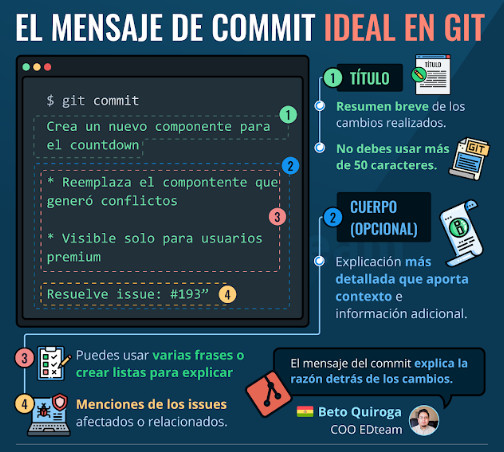

# GIT

## Índice

1. [git init](#id1)
2. [git config](#id2)
3. [git add](#id3)
4. [git commit](#id4)
5. [git branch](#id5)
6. [git merge](#id6)
7. [git checkout](#id7)
8. [git remote](#id8)
9. [git clone](#id9)
10. [git fetch/pull](#id10)
11. [git push](#id11)
12. [git status](#id12)
13. [git log](#id13)
14. [git tag](#id14)
15. [git diff](#id15)
16. [git mv/rm](#id16)
17. [git .ignore](#id17)
18. [git version](#id18)
19. [git stash](#id19)
20. [git reset](#id20)
21. [git rebase](#id21)
22. [git help](#id22)

## Git init
Sirve para inicializar sistema archivo git en la ruta

1.- `cd /path/to/your/existing/code
    git init`

2.- `git init <project directory>`

## Git config
#### Configura información de usuario
- `git config --global user.name <name>`
- `git config --local user.email <email>`
- `git config --global --edit`
- `git config --global -e`
- `git config --system core.editor <editor>` 

#### Configuración de alias
- `git config --global alias.<alias-name> <git-command>`
- `git config --global alias.st status`
- `git config --global alias.co checkout`
- `git config --global alias.br branch`
- `git config --global alias.up rebase`
- `git config --global alias.ci commit`
- `git --global alias.lg “log --online --decore --all -- graph”`
- `git status config --global alias.s “status -s -b”`

## Git add
Agrega al stage los archivos indicados

- `git add <archive.py>`
- `git add --all`
- `git add .`
- `git add -u`
- `git add -A`
- `git add *.png`
- `git add <nombre_carpeta/>`

## Git commit
Se agregan los archivos del stage al repositorio

- `git commit -m “<Se creo el archivo.py>”`
- `git commit --amend -m “<Actualizamos el readme.md>”`
- `git commit –am “<Se actualiza el archivo.txt>”`
- `git commit`
-  `git add <archivo_olvidado>`
-  `git commit --amend --no-edit`

## Git branch
- `git branch`
- `git branch <rama-name>`
- `git branch <ramas_remotas> -a`
- `git branch -D <rama-develop-borrar>`

## Git merge
Une los commits de una rama a otra rama
- `git merge <branch-name>`

## Git checkout
Sirve para cambiar de rama o revertir cambios en archivos del ultimo commit.

#### Cambiar rama

- `git checkout -b <NombreDeBranch>`
- `git checkout <NombreDeBranch>`

#### Revertir cambios en archivos

- `git checkout -- <README.md>`
- `git check out -- .`

## Git remote
- `git remote add <remote_name> <remote_repo_url>`
- `git remote add <origin> <https://github.com/FabianEncinaEscobar/prueba-1.git>`
- `git remote –v`
- `Git remote add <nameRepository> <https://github.com/nameRe>`
- `git remote remove origin`

## Git clone
`git clone <repo url>`

## Git fetch/pull
- `git pull <remote>`
- `git pull <origin> <master>`
- `git pull --all`
- `git fetch <remote>`
- `git fetch <origin> <master>`
- `git fetch --all`

## Git push
- `git push -u <remote_name> <local_branch_name>`
- `git push -u <origin> <master>`
- `git push --tags`
- `git push <origin> :<rama-x>`
- `git push –-force <origin> <master>`

## Git status
Sirve para ver el estado de los archivos
- `git status`
- `git status  -s`
- `git status –s -b`

## Git log
Sirve para ver los logs de git

- `git log`
- `git log --oneline --decorate --all --graph`

## Git tag
- `git tag`
- `git tag <nombreRelease>`
- `git tag –d <nombreRelease>`
- `git tag -a <v1.0.0> -m “<Versión 1.0.0>”`
- `git tag -a <v0.1.0> <numeroCommit> -m “<Version alfa>”`
- `git show <v1.0.0>`

## Git diff
- `git diff`
- `git diff --staged`
- `git diff <nueva-rama> <master>`

## Git mv/rm
Comandos para mover, cambiar de nombre o remover archivos del repositorio.
- `git mv <destruir-mundo.txt> <salvar-mundo.txt>`
- `git rm <salvar-mundo.txt>`

## Git .ignore
Ignorar archivos o carpetas que no queremos modificar con git

- Crear archivo con nombre .gitignore
- Escribir en archivo creado los nombres de archivos a ignorar.

    - *.log
    - Carpeta/carp/

## Git version
`git version`

## Git stash

#### Enviar un grupo de rama al stash
- `git stash`
- `git stash save`
- `git stash save --keep-index`
- `git stash save --include-untracked`
- `git stash save “<Agregamos a loki en los villanos>”`

#### Mostrar lista de stash
- `git stash list`
- `git stash list --stat`

#### Saca y elimina ultimo elemento del stash
- `git stash pop`
- `git stash apply stash@{1}`

#### Elimina stash
- `git stash drop`
- `git stash drop stash@{2}`

#### Borra todas las entradas en el stash
- `git stash clear`

### Git reset
Deshacer cambios realizados en el repositorio
- `git reset *.xml`
- `git reset HEAD <README.md>`
- `git reset --soft HEAD^`
- `git reset --mixed <860c6c2>`
- `git reset --hard <860c6c2>`
- `git reflog`

### Git rebase
##### Mueve ramas a posición indicada
- `git rebase master`
- `git rebase --i HEAD~3`

### Git help
`git help`
